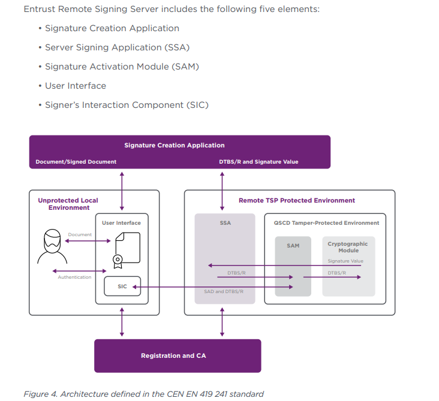

# 🌐 **Remote Signing** System Design & Architecture

## 📚 **System Design Overview**
### I refer to the design of entrust, a famous remote signing supplier in the market. You can find the original design [here](https://www.entrust.com/sites/default/files/documentation/brochures/trustedx-remote-signing-eidas-br.pdf).

### I converted the design follow my understanding and the current project's requirements.

### The system design consists of the following components:
1. **User interface:** The user-facing application that initiates signing requests or views signed documents.
2. **eContract Management System:** The module responsible for managing eContracts and their associated documents.
This system interacts with the Remote Signing System to sign documents.
We are going to develop this module at the same time as the Remote Signing System.
3. **Remote Signing System:** The core component that handles signing requests, signature validation.
Hardware Security Module (HSM) integration was not used in this project. we can use software-based signing for testing purposes.
See the [Module System Design](#module-system-design) for more details.
4. **CA Management System:** The Certificate Authority (CA) Management System that issues certificates for signing.
We will integrate with a third-party CA service to issue certificates. Or we can use a self-signed certificate for testing purposes.
We will not develop this module in this project or we can develop it in the future.

<h3 id="module-system-design">🚀 <b>Module System Design</b></h2>

